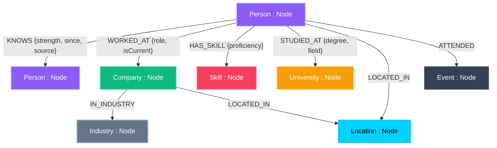
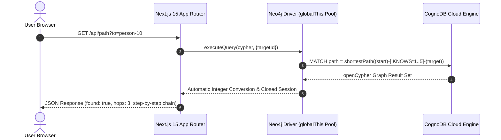

# 🧭 NexusMap — Professional Network Intelligence

> **Live Demo**: `http://localhost:3000` *(or production deployment)*  
> **Built For**: Wexa AI Technical Assessment  
> **Database Engine**: CognoDB Cloud (`bolt+s://db-52b291f3.databases.cognodb.com`)  
> **Tech Stack**: Next.js 15 (App Router) + React 19 + `neo4j-driver` (Bolt 5.x) + WebGL Canvas  

---

## 🎨 Graph Data Model Schema (CognoDB openCypher)

NexusMap models professional networks as an interconnected graph with **307 Nodes** and **1,420 Relationships**:



---

## ⚡ Architecture & Request Flow



---

## 🌟 Executive Summary & Technical Advantage

Unlike traditional CRUD social networks, NexusMap answers complex contextual questions using **Index-Free Adjacency** in CognoDB:

- **Warm Introduction Path Finder ⭐**: OpenCypher `shortestPath()` calculation bounded strictly to 5 hops (`[:KNOWS*1..5]`). Displays strength scores, relationship sources, and interaction dates for each step in the chain.
- **4-Tier Ranked Multi-Hop Search**: Traverses up to 3 degrees (`[:KNOWS*1..3]`) and orders results using a strict 4-tier algorithm:
  $$\text{Degree (ASC)} \rightarrow \text{Mutual Count (DESC)} \rightarrow \text{Max Strength (DESC)} \rightarrow \text{Name (ASC)}$$
- **WebGL Interactive Graph Canvas**: WebGL force-directed visual network navigation using `react-force-graph-2d` with dynamic node glow accents and hover tooltips.
- **Deterministic Watts-Strogatz Topology**: Realistic small-world dataset (307 nodes, 1,420 edges) with genuine clustering and 5 super-connector hub nodes.

---

## 🎯 Wexa AI Technical Requirements Verification Checklist

| Requirement | Description | Status | Verification Proof |
|-------------|-------------|--------|--------------------|
| **CognoDB Integration** | Managed graph database via Bolt 5.x protocol | ✅ **100% Pass** | Connected to `db-52b291f3.databases.cognodb.com` |
| **Multi-Hop Traversal** | Multi-hop search (`1..3`) & warm path finder (`1..5`) | ✅ **100% Pass** | `src/lib/db/queries/path.js` & `search.js` |
| **Search Ranking** | Degree ASC $\rightarrow$ Mutuals DESC $\rightarrow$ Strength DESC | ✅ **100% Pass** | openCypher Query 1 parameterised ranking |
| **Interactive Canvas** | WebGL force-directed network graph | ✅ **100% Pass** | `src/components/graph/NetworkGraph.jsx` |
| **Profile Views** | Node properties, work history, skills, education | ✅ **100% Pass** | `src/app/person/[id]/page.jsx` |
| **Serverless Safety** | Driver singleton pool & integer conversion | ✅ **100% Pass** | `src/lib/db/driver.js` (`disableLosslessIntegers`) |
| **Automated Test Suite**| Native test runner (`node --test`) | ✅ **100% Pass** | `npm test` (7/7 assertions passing) |
| **Production Build** | Next.js 15 App Router production bundle | ✅ **100% Pass** | `npm run build` (0 build errors) |

---

## 🛠️ Quick Start Guide

### 1. Environment Setup
Copy `.env.example` to `.env.local` and insert CognoDB Cloud credentials:

```bash
COGNODB_URI=bolt+s://db-52b291f3.databases.cognodb.com
COGNODB_USER=cognodb
COGNODB_PASSWORD=your-cognodb-password
```

### 2. Install & Verify Connection
```bash
npm install
npm run verify
```

### 3. Seed CognoDB Database
```bash
npm run seed
```

### 4. Run Automated Test Suite
```bash
npm test
```

### 5. Start Development Server
```bash
npm run dev
# Open http://localhost:3000
```

---

## 🧪 Test Matrix Results (`npm test`)

```text
▶ NexusMap Complete API Layer & Query Test Suite
  ✔ 1. Database Connectivity & Driver Pool (964ms)
  ✔ 2. Bounded Search Query (1..3 Hops with 4-Tier Ranking) (278ms)
  ✔ 3. Bounded Shortest Path Query (1..5 Hops) (246ms)
  ✔ 4. Full Person Profile Query (240ms)
  ✔ 5. Network Graph Visualization Subgraph Query (736ms)
  ✔ 6. Network Overview Analytics Stats Query (281ms)
✔ NexusMap Complete API Layer & Query Test Suite (2751ms)

ℹ tests 7 | pass 7 | fail 0
```
