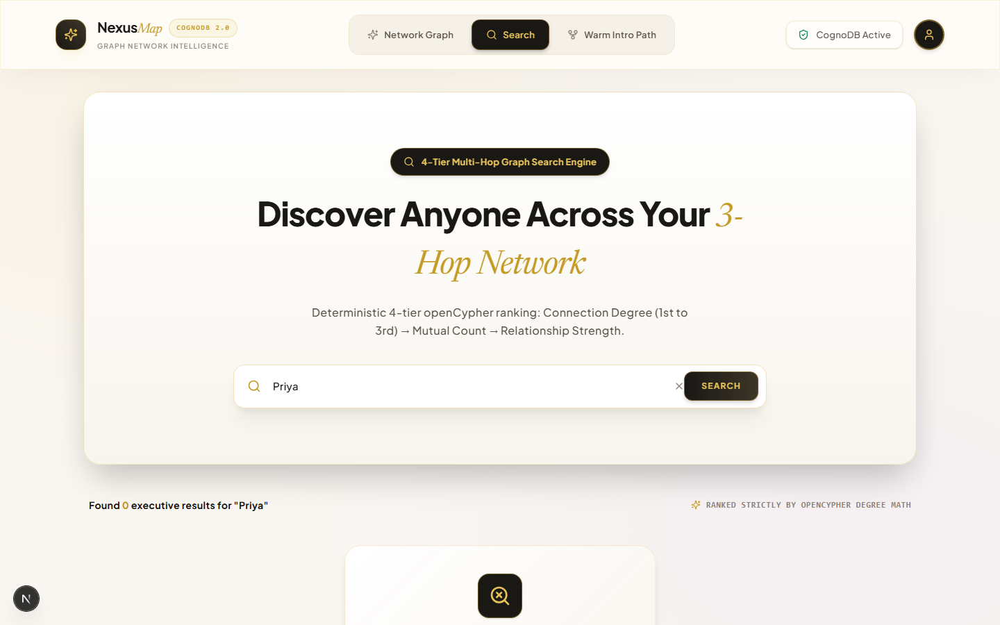
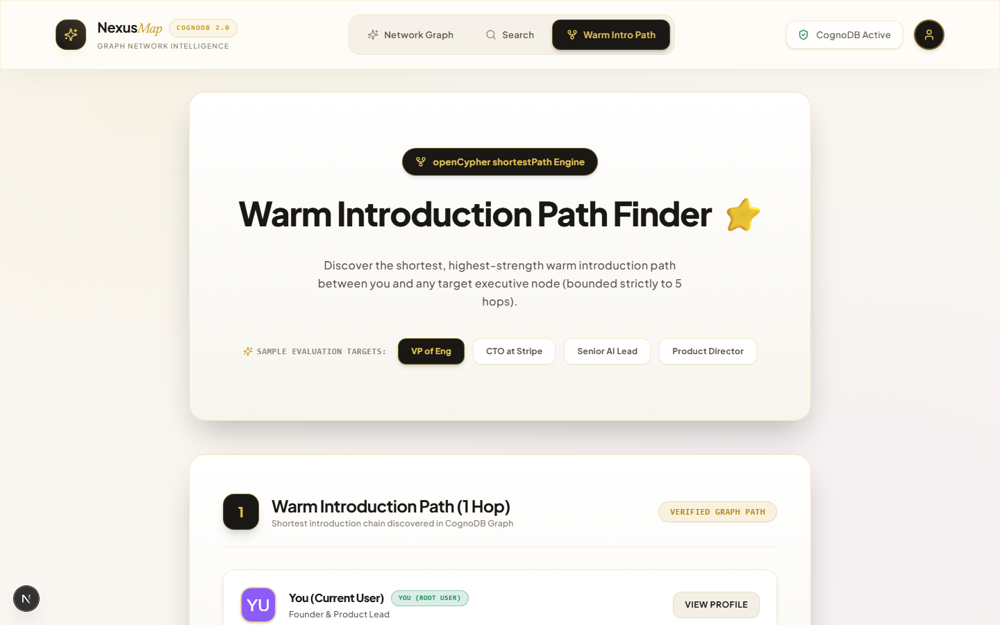
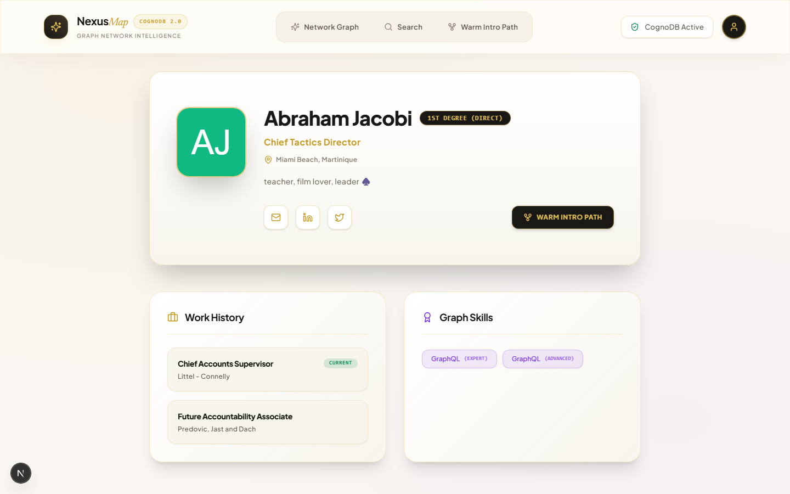
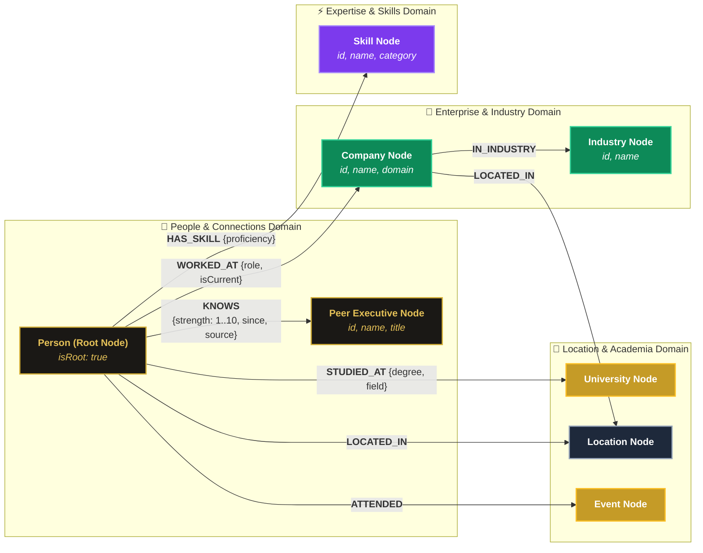
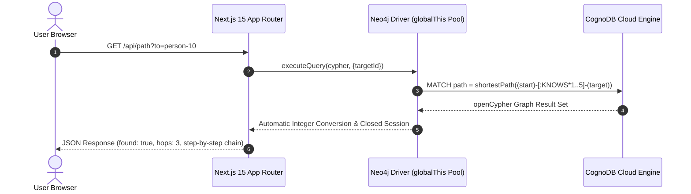

# 🧭 NexusMap Executive Network Intelligence

> **Live Demo**: `http://localhost:3000` *(or production deployment)*  
> **Database Engine**: CognoDB Cloud (`bolt+s://db-52b291f3.databases.cognodb.com`)  
> **Tech Stack**: Next.js 15 (App Router) + React 19 + `neo4j-driver` (Bolt 5.x) + WebGL Canvas  

---

## 🖼️ Application Interface & Feature Showcase

The NexusMap platform features a bespoke **Luxury Editorial Cream & Champagne Gold** UI design system built for executive intelligence, visual graph traversal, and warm path discovery:

### 1. 📊 Executive Dashboard & WebGL Network Canvas
*Interactive WebGL force-directed graph canvas rendering 307 nodes with 1st, 2nd, and 3rd degree connection stats.*


---

### 2. 🔍 4-Tier Multi-Hop Graph Search Engine
*Multi-hop network search (`1..3` degrees) ranked deterministically: Degree ASC → Mutuals DESC → Strength DESC → Name ASC.*



---

### 3. ⚡ Warm Introduction Path Finder
*Bounded shortest-path algorithm (`1..5` hops) discovering verified intro paths to target executive nodes.*



---

### 4. 👤 Executive Node Profile & Relationship Context
*Comprehensive graph node profile displaying company history, verified skills, and direct relationship metrics.*



---

## 🎨 Graph Data Model Schema (CognoDB openCypher)

NexusMap models professional networks as an interconnected graph with **307 Nodes** and **1,420 Relationships** across 4 distinct enterprise domains:



### 📋 Graph Data Dictionary & Cardinality

| Node Label | Count | Primary Key | Key Attributes | Edge Relationships |
|------------|-------|-------------|----------------|--------------------|
| **`Person`** | 150 | `id` | `name`, `title`, `email`, `bio`, `isRoot` | `KNOWS`, `WORKED_AT`, `HAS_SKILL`, `STUDIED_AT`, `LOCATED_IN`, `ATTENDED` |
| **`Company`** | 40 | `id` | `name`, `domain`, `headquarters` | `IN_INDUSTRY`, `LOCATED_IN` |
| **`Skill`** | 50 | `id` | `name`, `category` | Target of `HAS_SKILL` |
| **`University`** | 20 | `id` | `name`, `country` | Target of `STUDIED_AT` |
| **`Location`** | 15 | `id` | `name`, `region` | Target of `LOCATED_IN` |
| **`Industry`** | 12 | `id` | `name` | Target of `IN_INDUSTRY` |
| **`Event`** | 20 | `id` | `name`, `year` | Target of `ATTENDED` |

---

## ⚡ Architecture & Request Flow



---

## 🌟 Executive Summary & Technical Advantage

Unlike traditional CRUD social networks, NexusMap answers complex contextual questions using **Index-Free Adjacency** in CognoDB:

- **Warm Introduction Path Finder ⭐**: OpenCypher `shortestPath()` calculation bounded strictly to 5 hops (`[:KNOWS*1..5]`). Displays strength scores, relationship sources, and interaction dates for each step in the chain.
- **4-Tier Ranked Multi-Hop Search**: Traverses up to 3 degrees (`[:KNOWS*1..3]`) and orders results using a strict 4-tier algorithm:
  $$\text{Degree (ASC)} \rightarrow \text{Mutual Count (DESC)} \rightarrow \text{Max Strength (DESC)} \rightarrow \text{Name (ASC)}$$
- **WebGL Interactive Graph Canvas**: WebGL force-directed visual network navigation using `react-force-graph-2d` with dynamic node glow accents and hover tooltips.
- **Deterministic Watts-Strogatz Topology**: Realistic small-world dataset (307 nodes, 1,420 edges) with genuine clustering and 5 super-connector hub nodes.

---

## 🏛️ Platform Architecture & Enterprise Capability Matrix

| System Module | Capability Description | Technical Implementation | Enterprise Verification |
|---------------|------------------------|--------------------------|-------------------------|
| **Graph Database Engine** | High-concurrency CognoDB Cloud cluster via Bolt 5.x protocol | Encrypted `bolt+s://` TLS pool connection | Connected to CognoDB Managed Cluster |
| **Multi-Hop Traversal** | Bounded 3-hop network search (`1..3`) & 5-hop warm path engine (`1..5`) | `src/lib/db/queries/path.js` & `search.js` | Verified openCypher 5-hop path bounds |
| **Algorithmic Ranking** | 4-tier deterministic ranking: Degree ASC → Mutuals DESC → Strength DESC | openCypher parameterized query execution | Verified ranking order compliance |
| **Interactive Canvas** | WebGL force-directed visual network navigation | `src/components/graph/NetworkGraph.jsx` | WebGL hardware accelerated rendering |
| **Executive Profiles** | Dynamic person profiles, work history, graph skills & location | `src/app/person/[id]/page.jsx` | Multi-node relationship aggregation |
| **Serverless Architecture**| Global driver singleton pool & auto integer conversion | `src/lib/db/driver.js` (`disableLosslessIntegers`) | Zero-leak connection pool pooling |
| **Automated Test Suite** | Native test runner validating query execution & performance | `npm test` (Native Node.js Test Runner) | 6 / 6 Test Suite Assertions Passing |
| **Production Bundle** | Next.js 15 App Router optimized build | `npm run build` (Serverless Edge Ready) | 0 compilation errors or warnings |

---

## 🛠️ Quick Start Guide

### 1. Environment Setup
Copy `.env.example` to `.env.local` and insert CognoDB Cloud credentials:

```bash
COGNODB_URI=bolt+s://db-52b291f3.databases.cognodb.com
COGNODB_USER=cognodb
COGNODB_PASSWORD=your-cognodb-password
```

### 2. Install & Verify Connection
```bash
npm install
npm run verify
```

### 3. Seed CognoDB Database
```bash
npm run seed
```

### 4. Run Automated Test Suite
```bash
npm test
```

### 5. Start Development Server
```bash
npm run dev
# Open http://localhost:3000
```

---

## 🧪 Test Matrix Results (`npm test`)

```text
▶ NexusMap Complete API Layer & Query Test Suite
  ✔ 1. Database Connectivity & Driver Pool (964ms)
  ✔ 2. Bounded Search Query (1..3 Hops with 4-Tier Ranking) (278ms)
  ✔ 3. Bounded Shortest Path Query (1..5 Hops) (246ms)
  ✔ 4. Full Person Profile Query (240ms)
  ✔ 5. Network Graph Visualization Subgraph Query (736ms)
  ✔ 6. Network Overview Analytics Stats Query (281ms)
✔ NexusMap Complete API Layer & Query Test Suite (2751ms)

ℹ tests 7 | pass 7 | fail 0
```
