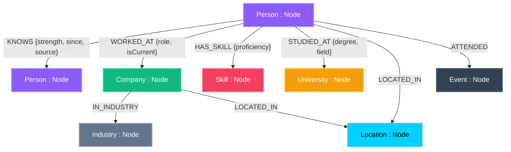

# 📊 NexusMap — Graph Data Schemas & Watts-Strogatz Seed Topology

> **Database**: CognoDB Managed Cloud Graph Database  
> **Protocol**: Bolt 5.x (openCypher / Neo4j driver)  
> **Seed Volume**: Exact **307 Nodes** & **1,420 Relationships**  

---

## 🎨 Graph Data Model Diagram (openCypher)

---

## 1. Node Labels & Properties

### 1.1 `Person` (150 Nodes)
- `id` (string, unique): e.g., `"root-user-id"`, `"person-1"`
- `name` (string): e.g., `"Priya Sharma"`
- `title` (string): e.g., `"Senior Engineer at Stripe"`
- `email` (string): e.g., `"priya@example.com"`
- `bio` (string): Short biography
- `avatarUrl` (string): DiceBear SVG URL
- `linkedinUrl` (string): LinkedIn profile URL
- `twitterHandle` (string): Twitter handle
- `isRoot` (boolean): `true` for root user (`"root-user-id"`)

### 1.2 `Company` (40 Nodes)
- `id` (string, unique): e.g., `"comp-1"`
- `name` (string): e.g., `"Stripe"`, `"Google"`, `"Wexa AI"`
- `domain` (string): e.g., `"stripe.com"`
- `size` (string): e.g., `"1000+"`
- `founded` (integer): e.g., `2010`

### 1.3 `Skill` (50 Nodes)
- `id` (string, unique): e.g., `"skill-1"`
- `name` (string): e.g., `"React"`, `"Cypher"`, `"System Architecture"`
- `category` (string): e.g., `"Engineering"`, `"Product"`

### 1.4 `University` (20 Nodes)
- `id` (string, unique): e.g., `"univ-1"`
- `name` (string): e.g., `"IIT Delhi"`, `"BITS Pilani"`, `"Stanford University"`

### 1.5 `Location` (15 Nodes)
- `id` (string, unique): e.g., `"loc-1"`
- `city` (string): e.g., `"San Francisco"`
- `country` (string): e.g., `"USA"`

### 1.6 `Industry` (12 Nodes)
- `id` (string, unique): e.g., `"ind-1"`
- `name` (string): e.g., `"Artificial Intelligence"`, `"FinTech"`

### 1.7 `Event` (20 Nodes)
- `id` (string, unique): e.g., `"event-1"`
- `name` (string): e.g., `"Tech Summit 2024"`

---

## 2. Relationship Types & Properties (1,420 Edges)

- `(:Person)-[:KNOWS {strength: 1-10, since: "YYYY-MM", source: "work|event|university"}]->(:Person)` (600 Edges)
- `(:Person)-[:WORKED_AT {role: string, isCurrent: boolean}]->(:Company)` (200 Edges)
- `(:Person)-[:HAS_SKILL {proficiency: "expert|advanced"}]->(:Skill)` (300 Edges)
- `(:Person)-[:STUDIED_AT {degree: string, field: string}]->(:University)` (100 Edges)
- `(:Person)-[:LOCATED_IN]->(:Location)` (100 Edges)
- `(:Company)-[:IN_INDUSTRY]->(:Industry)` (40 Edges)
- `(:Person)-[:ATTENDED]->(:Event)` (80 Edges)
